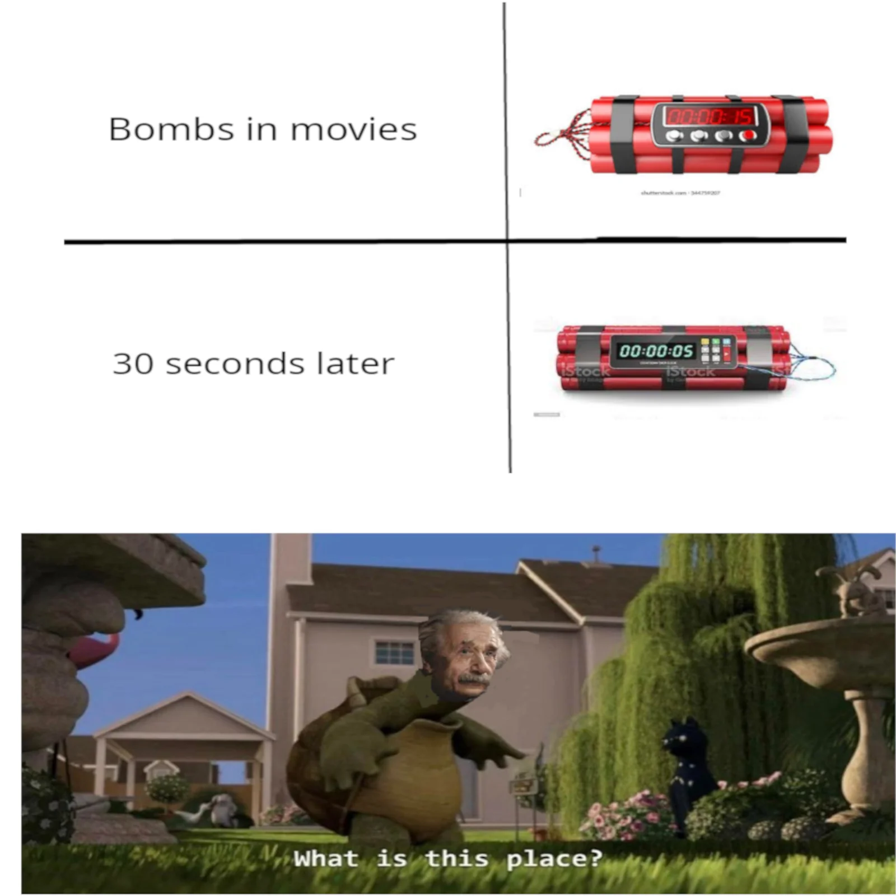

Here is a glossary adventurer! I hope you enjoy it :)
- [Task 1) Code Analysis and Refactoring ⛏️](#task-1-code-analysis-and-refactoring-️)
  - [a) From DRY to Design Patterns](#a-from-dry-to-design-patterns)
    - [Part A Merge Request Links:](#part-a-merge-request-links)
    - [Pinpointing the code smell](#pinpointing-the-code-smell)
    - [Selecting Design Pattern](#selecting-design-pattern)
    - [Justification](#justification)
    - [Was the pattern well implemented?](#was-the-pattern-well-implemented)
  - [b) Observer Pattern](#b-observer-pattern)
    - [Subject: `Switch.java class`](#subject-switchjava-class)
    - [Observers: `Bomb.java class`](#observers-bombjava-class)
    - [Subject: `Switch.java class`](#subject-switchjava-class-1)
    - [Observers: `Bomb.java class`](#observers-bombjava-class-1)
  - [c) Inheritance Design](#c-inheritance-design)
    - [Code smell](#code-smell)
    - [Code smell](#code-smell-1)
  - [d) More Code Smells](#d-more-code-smells)
  - [e) Open-Closed Goals](#e-open-closed-goals)
  - [f) Open Refactoring](#f-open-refactoring)
    - [Violations of Law of Demeter](#violations-of-law-of-demeter)
      - [Fix: violation of Law of Demeter + Badly named variables in `EntityFactory` `spawnSpider` method](#fix-violation-of-law-of-demeter--badly-named-variables-in-entityfactory-spawnspider-method)
      - [Fix: violation of Law of Demeter + badly named viarbales in `EntityFactory` in `spawnZombie`](#fix-violation-of-law-of-demeter--badly-named-viarbales-in-entityfactory-in-spawnzombie)
      - [Fix: violation of Law of Demeter in `Portal` in `canTeleportTo`](#fix-violation-of-law-of-demeter-in-portal-in-canteleportto)
      - [Fix: violation of Law of Demeter in `Portal` in `doTeleport`](#fix-violation-of-law-of-demeter-in-portal-in-doteleport)
      - [Fix: violation of Law of Demeter in `Goal` in `achieved`](#fix-violation-of-law-of-demeter-in-goal-in-achieved)
      - [Fix: violation of Law of Demeter in `GameMap.java` in `initRegisterSpawners`](#fix-violation-of-law-of-demeter-in-gamemapjava-in-initregisterspawners)
      - [Fix: violation of Law of Demeter in `GameMap.java` in `canMoveTo`](#fix-violation-of-law-of-demeter-in-gamemapjava-in-canmoveto)
    - [Violations of Liskov Substitution Principle](#violations-of-liskov-substitution-principle)
      - [\[Fix: violation of LSP in `Arrow`. Has unused methods inherited from `Entity`\](/put/links/here](#fix-violation-of-lsp-in-arrow-has-unused-methods-inherited-from-entityputlinkshere)
      - [Fix: violation of LSP in `Bomb`. Has unused methods inherited from `Entity`](#fix-violation-of-lsp-in-bomb-has-unused-methods-inherited-from-entity)
      - [Fix: violation of LSP in `Sword`. Has unused methods inherited from `Entity`](#fix-violation-of-lsp-in-sword-has-unused-methods-inherited-from-entity)
      - [Fix: violation of LSP in `Treasure`. Has unused methods inherited from `Entity`](#fix-violation-of-lsp-in-treasure-has-unused-methods-inherited-from-entity)
      - [Fix: violation of LSP in `Wood`. Has unused methods inherited from `Entity`](#fix-violation-of-lsp-in-wood-has-unused-methods-inherited-from-entity)
      - [Fix: violation of LSP in `Boulder`. Has unused methods inherited from `Entity`](#fix-violation-of-lsp-in-boulder-has-unused-methods-inherited-from-entity)
      - [Fix: violation of LSP in `Door`. Has unused methods inherited from `Entity`](#fix-violation-of-lsp-in-door-has-unused-methods-inherited-from-entity)
      - [Fix: violation of LSP in `Exit`. Has unused methods inherited from `Entity`](#fix-violation-of-lsp-in-exit-has-unused-methods-inherited-from-entity)
      - [Fix: violation of LSP in `Player`. Has unused methods inherited from `Entity`](#fix-violation-of-lsp-in-player-has-unused-methods-inherited-from-entity)
      - [Fix: violation of LSP in `Exit`. Has unused methods inherited from `Entity`](#fix-violation-of-lsp-in-exit-has-unused-methods-inherited-from-entity-1)
      - [Fix: violation of LSP in `Switch`. Has unused methods inherited from `Entity`](#fix-violation-of-lsp-in-switch-has-unused-methods-inherited-from-entity)
      - [Fix: violation of LSP in `Wall`. Has unused methods inherited from `Entity`](#fix-violation-of-lsp-in-wall-has-unused-methods-inherited-from-entity)
- [Task 2) Evolution of Requirements 👽](#task-2-evolution-of-requirements-)
  - [a) Microevolution - Enemy Goal 🥷](#a-microevolution---enemy-goal-)
  - [Choice 1 (Bosses) 😈👹👺👾](#choice-1-bosses-)
  - [Choice 2 (2f Logic Switches) 🧠💡🚪](#choice-2-2f-logic-switches-)
    - [Observer Pattern](#observer-pattern)
    - [State Pattern](#state-pattern)
    - [Strategy Pattern](#strategy-pattern)
    - [Factory Pattern](#factory-pattern)
    - [Assumptions](#assumptions)
- [Task 3) Investigation Task ⁉️](#task-3-investigation-task-️)
  - [Failing regression tests - BombTests 💣](#failing-regression-tests---bombtests-)
  - [Logical Rules --\> Logical Factory 🏭](#logical-rules----logical-factory-)
  - [Limitations to testing 🧪](#limitations-to-testing-)
  - [Testing for error input ❌](#testing-for-error-input-)
  - [Unusued patterns which would of been excellent to use 🏁](#unusued-patterns-which-would-of-been-excellent-to-use-)

## Task 1) Code Analysis and Refactoring ⛏️

### a) From DRY to Design Patterns
#### Part A Merge Request Links:

[2024-07-11 - Add: pair blog post update for Task 1a-c](https://nw-syd-gitlab.cseunsw.tech/COMP2511/24T2/tea3ms/T15A_JALAPENO/assignment-ii/-/merge_requests/1)

[12/07/2024 - Created MovementStrategy Interface](https://nw-syd-gitlab.cseunsw.tech/COMP2511/24T2/teams/T15A_JALAPENO/assignment-ii/-/merge_requests/3)

[15/07/2024 - Implemented RetreatStrategy and PursueStrategy](https://nw-syd-gitlab.cseunsw.tech/COMP2511/24T2/teams/T15A_JALAPENO/assignment-ii/-/merge_requests/5)

[19/7/2024 - Implemented AllyStrategy and Random Strategy](https://nw-syd-gitlab.cseunsw.tech/COMP2511/24T2/teams/T15A_JALAPENO/assignment-ii/-/merge_requests/13)

> i. Look inside src/main/java/dungeonmania/entities/enemies. Where can you notice an instance of repeated code? Note down the particular offending lines/methods/fields.
#### Pinpointing the code smell
* When the player is `Invincible` the `Mercenary` and `ZombieToast` use the same movement algorithm
```java
} else if (map.getPlayer().getEffectivePotion() instanceof InvincibilityPotion) {
} else if (map.getPlayer().getEffectivePotion() instanceof InvincibilityPotion) {
            Position plrDiff = Position.calculatePositionBetween(map.getPlayer().getPosition(), getPosition());

            Position moveX = (plrDiff.getX() >= 0) ? Position.translateBy(getPosition(), Direction.RIGHT)
                    : Position.translateBy(getPosition(), Direction.LEFT);
            Position moveY = (plrDiff.getY() >= 0) ? Position.translateBy(getPosition(), Direction.UP)
                    : Position.translateBy(getPosition(), Direction.DOWN);
            Position offset = getPosition();
            if (plrDiff.getY() == 0 && map.canMoveTo(this, moveX))
                offset = moveX;
            else if (plrDiff.getX() == 0 && map.canMoveTo(this, moveY))
                offset = moveY;
            else if (Math.abs(plrDiff.getX()) >= Math.abs(plrDiff.getY())) {
                if (map.canMoveTo(this, moveX))
                    offset = moveX;
                else if (map.canMoveTo(this, moveY))
                    offset = moveY;
                else
                    offset = getPosition();
            } else {
                if (map.canMoveTo(this, moveY))
                    offset = moveY;
                else if (map.canMoveTo(this, moveX))
                    offset = moveX;
                else
                    offset = getPosition();
            }
            nextPos = offset;
```


> ii. What Design Pattern could be used to improve the quality of the code and avoid repetition? Justify your choice by relating the scenario to the key characteristics of your chosen Design Pattern.
#### Selecting Design Pattern
We select the Strategy Pattern to create interface `MovementStrategy` of different moving algorithms called `RetreatStrategy`, `PursueStrategy`,  `AllyStrategy` and `RandomStrategy`
#### Justification
Leverage *encapsulation*
- Enapsulate logic for different movement algorithms into separate classes reducing length of the `move` methods in each enemy type

Reduces *repetition*
- Repeated logic in the `move` method in `Enemy` is reused by the `MovementStrategies`

Code is more *extensible*
- New movement strategies for can be added easily without modifying existing code in the `move` methods
- New enemy types can be created and new `MovementStrategies` can also be created and implemented in a modular fashion.

> iii. Using your chosen Design Pattern, refactor the code to remove the repetition.
#### Was the pattern well implemented?

- Identified which parts of the enemy movement algorithms could be abstracted out to classes
- Started by looking at attritubtes that needed to be passed to the `MovementStrategy`
- Refactored code by removing it from the enemy type and placing it into the relevant movement algorithm
- Ensured regression tests were passing before creating merge requests

### b) Observer Pattern

> Identify one place where the Observer Pattern is present in the codebase, and outline how the implementation relates to the key characteristics of the Observer Pattern.

In `Switch.java`
```java
package dungeonmania.entities;

import java.util.ArrayList;
import java.util.List;

import dungeonmania.entities.collectables.Bomb;
import dungeonmania.map.GameMap;
import dungeonmania.util.Position;

public class Switch extends Entity {
    private boolean activated;
    private List<Bomb> bombs = new ArrayList<>();

    public Switch(Position position) {
        super(position.asLayer(Entity.ITEM_LAYER));
    }

    public void subscribe(Bomb b) {
        bombs.add(b);
    }

    public void subscribe(Bomb bomb, GameMap map) {
        bombs.add(bomb);
        if (activated) {
            bombs.stream().forEach(b -> b.notify(map));
        }
    }

    public void unsubscribe(Bomb b) {
        bombs.remove(b);
    }

    @Override
    public boolean canMoveOnto(GameMap map, Entity entity) {
        return true;
    }

    @Override
    public void onOverlap(GameMap map, Entity entity) {
        if (entity instanceof Boulder) {
            activated = true;
            bombs.stream().forEach(b -> b.notify(map));
        }
    }

    @Override
    public void onMovedAway(GameMap map, Entity entity) {
        if (entity instanceof Boulder) {
            activated = false;
        }
    }

    public boolean isActivated() {
        return activated;
    }

    @Override
    public void onDestroy(GameMap gameMap) {
        return;
    }
}
```
#### Subject: `Switch.java class` 
* Maintains a list of `Observers` in `private List<Bomb> bombs = new ArrayList<>()`
* Updates observers when it state changes from activation to deactivation
* In the method `onOverlap` when the `Boulder` overlaps with the `Switch` all subscribers are notified by calling the `notify` method.
* Implements `subscribe` and `unsubscribe` so instances of `Bomb` can register/unregister themselves with a `Switch`

#### Observers: `Bomb.java class`
* Implements the `notify` method to update its state based on notifications from `Switch`

In `Switch.java`
```java
package dungeonmania.entities;

import java.util.ArrayList;
import java.util.List;

import dungeonmania.entities.collectables.Bomb;
import dungeonmania.map.GameMap;
import dungeonmania.util.Position;

public class Switch extends Entity {
    private boolean activated;
    private List<Bomb> bombs = new ArrayList<>();

    public Switch(Position position) {
        super(position.asLayer(Entity.ITEM_LAYER));
    }

    public void subscribe(Bomb b) {
        bombs.add(b);
    }

    public void subscribe(Bomb bomb, GameMap map) {
        bombs.add(bomb);
        if (activated) {
            bombs.stream().forEach(b -> b.notify(map));
        }
    }

    public void unsubscribe(Bomb b) {
        bombs.remove(b);
    }

    @Override
    public boolean canMoveOnto(GameMap map, Entity entity) {
        return true;
    }

    @Override
    public void onOverlap(GameMap map, Entity entity) {
        if (entity instanceof Boulder) {
            activated = true;
            bombs.stream().forEach(b -> b.notify(map));
        }
    }

    @Override
    public void onMovedAway(GameMap map, Entity entity) {
        if (entity instanceof Boulder) {
            activated = false;
        }
    }

    public boolean isActivated() {
        return activated;
    }

    @Override
    public void onDestroy(GameMap gameMap) {
        return;
    }
}
```
#### Subject: `Switch.java class` 
* Maintains a list of `Observers` in `private List<Bomb> bombs = new ArrayList<>()`
* Updates observers when it state changes from activation to deactivation
* In the method `onOverlap` when the `Boulder` overlaps with the `Switch` all subscribers are notified by calling the `notify` method.
* Implements `subscribe` and `unsubscribe` so instances of `Bomb` can register/unregister themselves with a `Switch`

#### Observers: `Bomb.java class`
* Implements the `notify` method to update its state based on notifications from `Switch`


### c) Inheritance Design

[2024-07-19 - Push down onMovedAway to Switch.java](https://nw-syd-gitlab.cseunsw.tech/COMP2511/24T2/teams/T15A_JALAPENO/assignment-ii/-/merge_requests/14)

[2024-07-19 - Add overlappable class](https://nw-syd-gitlab.cseunsw.tech/COMP2511/24T2/teams/T15A_JALAPENO/assignment-ii/-/merge_requests/15)

[2024-07-19 - Add destroyable class](https://nw-syd-gitlab.cseunsw.tech/COMP2511/24T2/teams/T15A_JALAPENO/assignment-ii/-/merge_requests/16)

> i. Name the code smell present in the above code. Identify all subclasses of Entity which have similar code smells that point towards the same root cause.

#### Code smell
* The code smell is `Refused Bequest`.
* Apparent when a subclass uses only some of the methods and properties inherited from the parents
* In `Exit.java` the methods `onOverlap`, `onMovedAway` and `onDestroy` are unused and are defined to return nothing.
* This is also apparent in
  * `Boulder.java`, `Door.java`, `Player.java`, `Portal.java`, `Switch.java`, `Wall.java`, `Buildable.java`, `Arrow.java`, `Bomb.java`, `Key.java`, `Sword.java`, `Treasure.java`, `Wood.java`, `Potion.java`, `Enemy.java`, `ZombieToastSpawner.java`
#### Code smell
* The code smell is `Refused Bequest`.
* Apparent when a subclass uses only some of the methods and properties inherited from the parents
* In `Exit.java` the methods `onOverlap`, `onMovedAway` and `onDestroy` are unused and are defined to return nothing.
* This is also apparent in
  * `Boulder.java`, `Door.java`, `Player.java`, `Portal.java`, `Switch.java`, `Wall.java`, `Buildable.java`, `Arrow.java`, `Bomb.java`, `Key.java`, `Sword.java`, `Treasure.java`, `Wood.java`, `Potion.java`, `Enemy.java`, `ZombieToastSpawner.java`

> ii. Redesign the inheritance structure to solve the problem, in doing so remove the smells.
* Push down method `onMovedAway` to `Switch.java` as this behaviour only makes sense to this class
  * In `GameMap.java` in the `triggerMovingAwayEvent` method we now check if `e` is an instanceof `Switch` before applying `onMovedAway`
* `onOverlap` only relevant to `Boulder.java`, `Door.java`, `Player.java`, `Portal.java`, `Switch.java`, `Arrow.java`, `Bomb.java`, `Key.java`, `Sword.java`, `Treasure.java`, `Wood.java`, `Potion.java`, `Enemy.java`, `Mercenary.java` and `ZombieToastSpawner.java`
  * We implement an abstract `Extract Sub Class` called `Overlappable` that has an abstract method called `onOverlap`
  * We change the above classes to implement `Overlappable`
  * Additionally, in the `GameMap` we check if the entity is an instance of `Overlappable` before triggering overlap event
* `onDestroy` only relevant to `Enemy.java` and `ZombieToastSpawner`
  * Implement an abstract `Extract Sub Class` called `Destroyable` that has an abstract method called `onDestroy`
  * In `GameMap.java` this affects the `destroyEntity` method. So we now check if entity is an instance of `Destroyable` before destroying
* Push down method `onMovedAway` to `Switch.java` as this behaviour only makes sense to this class
  * In `GameMap.java` in the `triggerMovingAwayEvent` method we now check if `e` is an instanceof `Switch` before applying `onMovedAway`
* `onOverlap` only relevant to `Boulder.java`, `Door.java`, `Player.java`, `Portal.java`, `Switch.java`, `Arrow.java`, `Bomb.java`, `Key.java`, `Sword.java`, `Treasure.java`, `Wood.java`, `Potion.java`, `Enemy.java`, `Mercenary.java` and `ZombieToastSpawner.java`
  * We implement an abstract `Extract Sub Class` called `Overlappable` that has an abstract method called `onOverlap`
  * We change the above classes to implement `Overlappable`
* `onDestroy` only relevant to `Enemy.java` and `ZombieToastSpawner`
  * Implement an abstract `Extract Sub Class` called `Destroyable` that has an abstract method called `onDestroy`
  * In `GameMap.java` this affects the `destroyEntity` method. So we now check if entity is an instance of `Destroyable` before destroying

### d) More Code Smells

[2024-07-19 - Refactor: pickUp occurs at level of player](https://nw-syd-gitlab.cseunsw.tech/COMP2511/24T2/teams/T15A_JALAPENO/assignment-ii/-/merge_requests/17)

> i. What design smell is present in the above description?
* This is `Shotgun Surgery`: when one has to make lots of little changes to many classes
* Currently the logic for picking up collectables is in each collectible class e.g. `Arrow.java` in the `onOverlap` method
* We use `Move method` to move the pick up logic into the `Player` class
* in `GameMap.java` add a method called `triggerPickUpEvent`
  * call this `triggerPickUpEvent` in both `moveTo` methods in `Gamemap.java`
  * `triggerPickUpEvent` checks if the player is overlapping with any items, and then adds the item to the inventory
  * As a result, many items which called `.pickUp` in the `onOverlap` method now have this method removed
  * `Bomb` had a special behaviour for `pickUp` which has now been shifted to the player level
  * Future refactoring could make a `pickUp` interface which will use the `Strategy Pattern` to use a different algorithm to pick up items depending on the item.

[Answer]

> ii. Refactor the code to resolve the smell and underlying problem causing it.

[Briefly explain what you did]

### e) Open-Closed Goals

[19/07/2024 - Refactored goal package to obey open-closed principle](https://nw-syd-gitlab.cseunsw.tech/COMP2511/24T2/teams/T15A_JALAPENO/assignment-ii/-/merge_requests/18)

> i. Do you think the design is of good quality here? Do you think it complies with the open-closed principle? Do you think the design should be changed?

The design is not of good quality because it does not obey the open-closed principle which states that software entities should be open to adding new functionalities to classes or modules without changing their existing code. This needed to change.

> ii. If you think the design is sufficient as it is, justify your decision. If you think the answer is no, pick a suitable Design Pattern that would improve the quality of the code and refactor the code accordingly.

To improve the code to obey the open-closed principle and remove the switch statements, we utilized polymorphism and introduced a composite pattern to handle the creation of specific goal types. Each goal type will have its own class that extends a base Goal class. We created individual classes for each leaf goal. We also split the composite goals into two specific classes for AND and OR.

### f) Open Refactoring

[17/07/2024 - Fixed hard-coding in buildable entities](https://nw-syd-gitlab.cseunsw.tech/COMP2511/24T2/teams/T15A_JALAPENO/assignment-ii/-/merge_requests/10)

The parameter values in the applyBuff() method and the durability condition value in the use() method are hardcoded to specific numbers in the Bow and Shield classes. This was fixed by moving them to configurable constants, which encapsulate the values, allowing easier adjustments without changing the code. This improvement makes the classes more maintainable and adaptable to future changes.

[18/07/2024 - Fixed hard-coding in potions package](https://nw-syd-gitlab.cseunsw.tech/COMP2511/24T2/teams/T15A_JALAPENO/assignment-ii/-/merge_requests/11)

Same issues as hardcoding in buildable entities.

[21/07/2024 - Improved potion effects state pattern design](https://nw-syd-gitlab.cseunsw.tech/COMP2511/24T2/teams/T15A_JALAPENO/assignment-ii/-/merge_requests/20)

To improve the design of the state pattern in these files, we should focus on making the states (invisibility and invincibility) more cohesive and encapsulated. The goal is to better manage the behavior changes that occur when these states are applied. We created a PotionState interface that defines the behavior for potion effects. We then implemented specific states for InvincibilityState and InvisibilityState. We modified the Potion class to use these states.
Lastly, we updated the InvincibilityPotion and InvisibilityPotion classes to use the new states. This refactoring improves the design by clearly separating the behavior of different potion effects into distinct state classes, following the State Pattern more effectively.

#### Violations of Law of Demeter
##### [Fix: violation of Law of Demeter + Badly named variables in `EntityFactory` `spawnSpider` method]([/put/links/here](https://nw-syd-gitlab.cseunsw.tech/COMP2511/24T2/teams/T15A_JALAPENO/assignment-ii/-/merge_requests/17))

- Instantiated additional variables and to reduce Law of Demeter violations
- Renamed `player` and `playerPos` for code clarity

##### [Fix: violation of Law of Demeter + badly named viarbales in `EntityFactory` in `spawnZombie`]([/put/links/here](https://nw-syd-gitlab.cseunsw.tech/COMP2511/24T2/teams/T15A_JALAPENO/assignment-ii/-/merge_requests/17))
- Instantiated additional variables and to reduce Law of Demeter violations
- Renamed `spawnerPos` and `pos` for code clarity

##### [Fix: violation of Law of Demeter in `Portal` in `canTeleportTo`]([/put/links/here](https://nw-syd-gitlab.cseunsw.tech/COMP2511/24T2/teams/T15A_JALAPENO/assignment-ii/-/merge_requests/17))
```java
List<Position> neighbours = getPosition().getCardinallyAdjacentPositions();
```
- Instantiated additional variables and to reduce Law of Demeter violations
- Renamed `portalPos` and `neighbours` for code clarity

##### [Fix: violation of Law of Demeter in `Portal` in `doTeleport`]([/put/links/here](https://nw-syd-gitlab.cseunsw.tech/COMP2511/24T2/teams/T15A_JALAPENO/assignment-ii/-/merge_requests/17))

- Instantiated additional variables and to reduce Law of Demeter violations
- Added `portalPos` and `destinations` for code clarity

##### [Fix: violation of Law of Demeter in `Goal` in `achieved`](/put/links/here)
```java
List<Exit> es = game.getMap().getEntities(Exit.class);
```
[Briefly explain what you did]

##### [Fix: violation of Law of Demeter in `GameMap.java` in `initRegisterSpawners`](/put/links/here)

```java
game.register(() -> game.getEntityFactory().spawnSpider(game), Game.AI_MOVEMENT, "spawnSpiders");
```
[Briefly explain what you did]

##### [Fix: violation of Law of Demeter in `GameMap.java` in `canMoveTo`](/put/links/here)
```java
 public boolean canMoveTo(Entity entity, Position position) {
        // TODO: fix law of demeter violation
        return !nodes.containsKey(position) || nodes.get(position).canMoveOnto(this, entity);
    }
```
[Briefly explain what you did]
#### Violations of Liskov Substitution Principle
##### [Fix: violation of LSP in `Arrow`. Has unused methods inherited from `Entity`]([/put/links/here](https://nw-syd-gitlab.cseunsw.tech/COMP2511/24T2/teams/T15A_JALAPENO/assignment-ii/-/merge_requests/15)
[2024-07-19 - Add destroyable class](https://nw-syd-gitlab.cseunsw.tech/COMP2511/24T2/teams/T15A_JALAPENO/assignment-ii/-/merge_requests/16)
- Upon redesigning inheritance, this removed the unused methods form `Arrow`

##### [Fix: violation of LSP in `Bomb`. Has unused methods inherited from `Entity`](https://nw-syd-gitlab.cseunsw.tech/COMP2511/24T2/teams/T15A_JALAPENO/assignment-ii/-/merge_requests/15)
[2024-07-19 - Add destroyable class](https://nw-syd-gitlab.cseunsw.tech/COMP2511/24T2/teams/T15A_JALAPENO/assignment-ii/-/merge_requests/16)
- Upon redesigning inheritance, this removed the unused methods form `Bomb`


##### [Fix: violation of LSP in `Sword`. Has unused methods inherited from `Entity`](https://nw-syd-gitlab.cseunsw.tech/COMP2511/24T2/teams/T15A_JALAPENO/assignment-ii/-/merge_requests/15)
[2024-07-19 - Add destroyable class](https://nw-syd-gitlab.cseunsw.tech/COMP2511/24T2/teams/T15A_JALAPENO/assignment-ii/-/merge_requests/16)
- Upon redesigning inheritance, this removed the unused methods form `Sword`

##### [Fix: violation of LSP in `Treasure`. Has unused methods inherited from `Entity`](https://nw-syd-gitlab.cseunsw.tech/COMP2511/24T2/teams/T15A_JALAPENO/assignment-ii/-/merge_requests/15)
[2024-07-19 - Add destroyable class](https://nw-syd-gitlab.cseunsw.tech/COMP2511/24T2/teams/T15A_JALAPENO/assignment-ii/-/merge_requests/16)
- Upon redesigning inheritance, this removed the unused methods form `Treasure`

##### [Fix: violation of LSP in `Wood`. Has unused methods inherited from `Entity`](https://nw-syd-gitlab.cseunsw.tech/COMP2511/24T2/teams/T15A_JALAPENO/assignment-ii/-/merge_requests/15)
[2024-07-19 - Add destroyable class](https://nw-syd-gitlab.cseunsw.tech/COMP2511/24T2/teams/T15A_JALAPENO/assignment-ii/-/merge_requests/16)
- Upon redesigning inheritance, this removed the unused methods form `Treasure`

##### [Fix: violation of LSP in `Boulder`. Has unused methods inherited from `Entity`](https://nw-syd-gitlab.cseunsw.tech/COMP2511/24T2/teams/T15A_JALAPENO/assignment-ii/-/merge_requests/15)
[2024-07-19 - Add destroyable class](https://nw-syd-gitlab.cseunsw.tech/COMP2511/24T2/teams/T15A_JALAPENO/assignment-ii/-/merge_requests/16)
- Upon redesigning inheritance, this removed the unused methods form `Treasure`
- Treasure implements `InventoryItem`

##### [Fix: violation of LSP in `Door`. Has unused methods inherited from `Entity`](https://nw-syd-gitlab.cseunsw.tech/COMP2511/24T2/teams/T15A_JALAPENO/assignment-ii/-/merge_requests/16)
- Upon redesigning inheritance, this removed the unused methods form `Entity`
- Door implements `Overlappable`

##### [Fix: violation of LSP in `Exit`. Has unused methods inherited from `Entity`](https://nw-syd-gitlab.cseunsw.tech/COMP2511/24T2/teams/T15A_JALAPENO/assignment-ii/-/merge_requests/16)
- Upon removing redundant methods in `Entity` this cleared the LSP violation

##### [Fix: violation of LSP in `Player`. Has unused methods inherited from `Entity`](https://nw-syd-gitlab.cseunsw.tech/COMP2511/24T2/teams/T15A_JALAPENO/assignment-ii/-/merge_requests/16)
```java
@Override
public void onMovedAway(GameMap map, Entity entity) {
    return;
}

@**Override**
public void onDestroy(GameMap gameMap) {
    return;
}
```

##### [Fix: violation of LSP in `Exit`. Has unused methods inherited from `Entity`](https://nw-syd-gitlab.cseunsw.tech/COMP2511/24T2/teams/T15A_JALAPENO/assignment-ii/-/merge_requests/16)
- Upon removing redundant methods in `Entity` this cleared the LSP violation


##### [Fix: violation of LSP in `Switch`. Has unused methods inherited from `Entity`](https://nw-syd-gitlab.cseunsw.tech/COMP2511/24T2/teams/T15A_JALAPENO/assignment-ii/-/merge_requests/16)
[Briefly explain what you did]
- implements `Overlappable`, `ElectricalSource`, `CurrentEmitter`, `Destroyable`
- Hence the redundant methods from `Entity` were removed, removing the LSP violation

##### [Fix: violation of LSP in `Wall`. Has unused methods inherited from `Entity`](/put/links/here)
- Upon removing redundant methods in `Entity` this cleared the LSP violation


## Task 2) Evolution of Requirements 👽

### a) Microevolution - Enemy Goal 🥷


> "I am my greatest enemy"
> - COMP2511 most sane enjoyer (most sane Java Developer)

[2024-07-23 - Add: testing and implementation for enemyGoal]([/put/links/here](https://nw-syd-gitlab.cseunsw.tech/COMP2511/24T2/teams/T15A_JALAPENO/assignment-ii/-/merge_requests/21))
[2024-07-23 - Add: more testing and implementation for enemyGoal]([/put/links/here](https://nw-syd-gitlab.cseunsw.tech/COMP2511/24T2/teams/T15A_JALAPENO/assignment-ii/-/merge_requests/22))

**Assumptions**

- We assumed that the default enemy goal is 1 which makes sense semantically i.e, an enemy goal implies that there is at least one enemy
- We assumed that destroying a `spawner` does not increase `numKills` i.e, does not contribute to the enemy goal

**Design**

- Create the `EnemyGoal` subclass which extends from `Goal` abstract class
- `EnemyGoal` implements two methods `achieved` and `toString`
- In `GoalFactory` the `enemy_goal` is passed to the `EnemyGoal` constructor via the JSON parser
```java
int enemyGoal = config.optInt("enemy_goal", 1);
```
- In `Game` at the conclusion of the battle, we track how many kills the player has accumulate.
```java
public void battle(Player player, Enemy enemy) {
    battleFacade.battle(this, player, enemy);
    if (player.getBattleStatistics().getHealth() <= 0) {
        map.destroyEntity(player);
    }
    if (enemy.getBattleStatistics().getHealth() <= 0) {
        map.destroyEntity(enemy);
        player.setNumKills(player.getNumKills() + 1);
    }
}
```
- This updates the `numKills` attribute in `Player`
- In the `EnemyGoal` the `achieved` method checks if the player has reached the `enemy_goal`  and if all `spawners` have been destroyed
- We added a `isDestroyed` attribute in the `ZombieToastSpawner` class and updated it to be destroyed when it was interacted with (if it was `isInteractable`)
- Within `EnemyGoal` we created a helper function to check if all `ZombieToastSpawners` were destroyed
```java
private boolean allSpawnersDestroyed(Game game) {
        GameMap map = game.getMap();
        List<ZombieToastSpawner> listOfSpawners = map.getEntities(ZombieToastSpawner.class);
        return listOfSpawners.stream().allMatch(ZombieToastSpawner::isDestroyed);
    }
```

**Changes after review**

- Originally had `allSpawnersDestroyed` in `GameMap` but then used the `Move Method` strategy to move this method into `EnemyGoal` which delegated the responsibility to the right class
**Test list**

[Test List]
- [x] test simple enemy goal with just 1 enemy
- [x] test simple enemy goal with just 1 enemy spawner
- [x] test simple enemy goal with just 1 enemy spawner and 1 enemy
- [x] test muliple enemy and multiple spawners
- [x] test `enemies` AND another goal
- [x] test `enemies_goal` OR another goal
- [x] test a complex goal with AND and OR
- [x] test interacting with same toast spawner doesn't reach goal
**Other notes**

- Note to future developers: we need to write more complex tests to cover a range of complex goals e.g. as in the MVP complex dungeons are tested as follows:
```java
 @Test
    @Tag("14-3")
    @DisplayName("Testing that the exit goal must be achieved last in EXIT and TREASURE")
    public void exitAndTreasureOrder() {
        DungeonManiaController dmc;
        dmc = new DungeonManiaController();
        DungeonResponse res = dmc.newGame("d_complexGoalsTest_exitAndTreasureOrder",
                "c_complexGoalsTest_exitAndTreasureOrder");

        assertTrue(TestUtils.getGoals(res).contains(":exit"));
        assertTrue(TestUtils.getGoals(res).contains(":treasure"));

        // move player onto exit
        res = dmc.tick(Direction.RIGHT);

        // don't check state of exit goal in string
        assertTrue(TestUtils.getGoals(res).contains(":treasure"));

        // move player to pick up treasure
        res = dmc.tick(Direction.RIGHT);

        // assert treasure goal met, but goal string is not empty
        assertFalse(TestUtils.getGoals(res).contains(":treasure"));
        assertNotEquals("", TestUtils.getGoals(res));

        // move player back onto exit
        res = dmc.tick(Direction.LEFT);

        // assert goal met
        assertEquals("", TestUtils.getGoals(res));
    }
```
### Choice 1 (Bosses) 😈👹👺👾


[Implemented Bosses Entities and Tests (Partially)](https://nw-syd-gitlab.cseunsw.tech/COMP2511/24T2/teams/T15A_JALAPENO/assignment-ii/-/merge_requests/28)

**Assumptions**

- When the player becomes invincible, the assassin retreats away from the player just like a regular mercenary.

**Design**

New classes: `Assassin`, `Hydra`

- `Assassin` contains the same fields and methods as `Mercenary` except with the addition of a new method `bribeFailed()` that generates a random double value between `0.0` and `1.0` using `Random.nextDouble()`. It compares the random value to the `bribeFailRate`. If the random value is greater than or equal to the `bribeFailRate`, it returns true. Otherwise, it returns false. There is a new field called `bribeFailRate`.

- `Hydra` contains the same fields and methods as `ZombieToast` except with the addition of a new method `healthIncreased()` that has the same chance calculation algorithm as `bribeFailed()` in the `Assassin` class. There are new fields called `healthIncreaseRate` and `healthIncreaseAmount`.

- Two new methods called `buildAssassin` and `buidHydra` are created in `EntityFactory` to allow assassins and hydras to be built when creating a new game.

**Changes after review**

[Design review/Changes made]

**Test list**

- [x] Test assassin in line with player moves towards them
- [x] Test assassin stops if they cannot move any closer to the player
- [x] Test assassins can not move through closed doors
- [x] Test assassin moves around a wall to get to the player
- [x] Testing hydras movement
- [x] Testing hydras cannot move through closed doors and walls

### Choice 2 (2f Logic Switches) 🧠💡🚪


[2024-07-24 - Add simple implementation for wire connections + OR LOGIC](https://nw-syd-gitlab.cseunsw.tech/COMP2511/24T2/teams/T15A_JALAPENO/assignment-ii/-/merge_requests/22)
[2024-07-24 - Add simple implementation for wire connections + OR LOGIC](https://nw-syd-gitlab.cseunsw.tech/COMP2511/24T2/teams/T15A_JALAPENO/assignment-ii/-/merge_requests/22)
[2024-07-24 - Fix: added AND logic and tests + fixed only wires being added as observers](https://nw-syd-gitlab.cseunsw.tech/COMP2511/24T2/teams/T15A_JALAPENO/assignment-ii/-/merge_requests/23)
[2024-07-24 - Fix: added XOR and COAND logic and tests + fixed only wires being added as observers](https://nw-syd-gitlab.cseunsw.tech/COMP2511/24T2/teams/T15A_JALAPENO/assignment-ii/-/merge_requests/24)
[2024-07-25 - Fix: passing dryrun for logic switches refactoring ANDLogicStrat](https://nw-syd-gitlab.cseunsw.tech/COMP2511/24T2/teams/T15A_JALAPENO/assignment-ii/-/merge_requests/25)
[2024-07-25 - Add: switch doors!](https://nw-syd-gitlab.cseunsw.tech/COMP2511/24T2/teams/T15A_JALAPENO/assignment-ii/-/merge_requests/26)


**Design**

#### Observer Pattern
- Purpose: to handle propagation of current from switches to wires and logical entities
- Justification: Logical entities (light bulbs, switch doors and bombs) observe switches and wires. When a switch is activated it notifies its observers (adjacent wires and logical entities) to update states
- Create an abstract class called `LogicalEntity` to classify `switch_door`, `bombs`, and `light_bulb_off`
- These are created as sub-classes
- `LogicalEntity` has methods to check if the entity `isActivated` and if the `LogicStrategy` is achieved
- We use a Depth-First-Search `DFS` to find all adjacent wires to form a circuit. This is implmented using a HashSet

#### State Pattern
- Purpose: to manage different states of switches and logical entities: e.g. on/off
- Justification: Each logical entity has state active/inactive and handles behaviour specific to that state
- Transitions between states based on logical rules OR/AND/XOR/CO_AND
- We track this with a boolean attribute called `activated`

#### Strategy Pattern
- Purpose: to handle different logical algorithms `OR`, `AND`, `XOR` and `CO_AND`
- Justification: set up a `LogicStrategy` interface. Sub classes implement concrete strategies for each logical condition
- Have methods to check if strategy is satisfied
- We create 4 different subclasses to house these algorithms

#### Factory Pattern
- Purpose: in `EntityFactory` at run time generate the `LogicStrategy` for `LogicalEntities`
- Justification: set up a `LogicFactory` class to handle the logic and methods to reduce clutter in `EntityFactory`
- We delegate responsibilities to separate classes to reduce coupling and increase cohesion

#### Assumptions
- Bombs when picked up they retain their logic type

**Changes after review**

- After reviewing Ed fourm posts we discovered that we had to modify `nameConverter` so that `light_bulb_on` could be detected after state change
- Added a `CurrentEmitter` interface to outline methods of retrieving time of when entities like `wires` were turned on

**Test list**

[Test List]
- [x] create bomb with logic field
- [x] Test creation of new entities: wire, switch_door and light bulb
- [x] activation of switch propagates to wires
- [x] deactivation of switch propgates to wires
- [x] activation and deactivation winding path of wires
- [x] test OR activation and deactivation
- [x] test AND activation and deactivation
- [x] test XOR activation and deactivation
- [x] test COAND activaiton and deactivation
- [x] switch is destroyed by bomb
- [x] middle of path is destroyed by bomb
- [x] switch_doors
- [x] logic bombs

**Other notes**

- TestUtils was changed so that `.equals` was used instead of `.startsWith`

## Task 3) Investigation Task ⁉️

### Failing regression tests - BombTests 💣
- There was a stage in our development of Logic Switches where we attempted to make `Bombs` a subclass of `LogicalEntity` akin to how `switch_door` and `light_bulb_off` were `LogicalEntities`. This caused a number of regression tests to fail
- We discovered that this would cause a number of regression tests to fail. We posit that this was due to how a number of pre-existing methods in `Game` and `GameMap` were handling `Entities` and not handling `LogicalEntities`
- We used `composition` instead to preserve `Bombs` as `Entities` and have an attribute called `LogicalStrategy` to process the logic of `Bomb`
- Albeit, a little clunky there are 2 constructors for bombs. We posit that if we planned this out more thoroughly we could of implemented bombs and `LogicalEntities` using `generics`. We decided it was too much work to do this at this stage because life gets very busy😭
```java
case "bomb":
            int bombRadius = config.optInt("bomb_radius", Bomb.DEFAULT_RADIUS);
            try {
                String bombLogic = jsonEntity.getString("logic");
                LogicStrategy bombStrategy = getLogicStrategy(bombLogic);
                return new Bomb(pos, bombRadius, bombStrategy);
            } catch (Exception e) {
                return new Bomb(pos, bombRadius);
            }
```

### Logical Rules --> Logical Factory 🏭
[Refactor: adding LogicFactory class](https://nw-syd-gitlab.cseunsw.tech/COMP2511/24T2/teams/T15A_JALAPENO/assignment-ii/-/merge_requests/29)
- Currently in `EntityFactory` we have a `getLogicStrategy` method that acquires the `logic` attribute from the config file
- We move this into a separate class called `LogicFactory` so that the responsibilities are delegated to separate functions for `extensability`, `readability` and `code-clarity`.
- We now use composition in `GameMap` to handle `LogicStrategy` creation

### Limitations to testing 🧪
- Due to a poor management of time and assigning tasks we came up with numerous edge case tests which would have stressed our the rigorousness of our implementations
- some include
  * testing mutliple switch interactions
  * chaining switches
  * creating loops/cycles in wire connections
  * ensuring system handles cycles and doesn't create infinite loops
  * multiple inputs to light bulbs
  * testing invalid JSON input and missing fields
- We also found that some of the provdided tests and the `TestUtils` had to be changed
  - e.g. `.startsWith()` had to be changed to `.equals` so that it would better count the entity types
  - This was discovered as per the ed post https://edstem.org/au/courses/16610/discussion/2095703 

### Testing for error input ❌
- We could of written more tests to cover error cases where JSON input. Our implementation was too reliant on `Design by Contract` where we counting on the client to give correct `dungeon_configs` and `maps
- To increase our coverage we should of thrown `IllegalArgumentExceptions` and `InvalidActionExceptions`  in the controller to cover a range of client-side inputs

### Unusued patterns which would of been excellent to use 🏁
- Using the `Template Pattern` which is behavioural pattern, would have cleaned up a lot of code-smells in regard to repetition
- For example in `EntityFactory` we could of created `LogicalEntities` with a skeleton template i.e, getting fields from the JSON config is a primitive operation but the creation of the `LogicStrategy` is implemented by the subclass

- Using the `Visitor Pattern` would have helped our the codebase and future developers to add extra functionalities without violating the open/closed principle
- We could of had a `visitor` to define the `onOverlap` or `onDestroy` poperations and create `Visitable` classes to provide data access. This would of made increased time-efficiency when editing methods, especially when refactoring

- The `Adaptor Pattern` could of been useful to extend the MVP specification. In future, there are possibilities to use the `Dungeon Generator` to output a JSON file that could be downloaded into the `tests` and `config` file.
- The adaptor pattern would have to parse this image or file so  that our codebase could continue to use the existing methods

- `Generic Pattern` would of been immensely useful in designing the circuits. We could of had each `Electrical Source` keep a list of generic observers which could of been `wires` or `switches`. - This would eliminated the need to `cast` and it would mean at compile time we have stronger type checks.
- Bugs would of been more detectable at compile time

- The `Singleton Pattern` would of been useful in ensuring that the `Player` class has only one instance.
- It would mean that there would a global access point to this instance, meaning we would avoid intialisation overhead when only 1 player is needed

- The `Decorator Pattern` would been useful for the `light_bulb_on` as it might of had different interactions compared to when it was `off`. It would of maintained its reference to `light_bulb_off` but forwarded its interactions like `onDestroy` to the `concreteDecorator` methods

Thank you comp2511 tutor for marking up to here! :D Best of luck with your assignments and marking :]]

