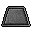

# 1. Preamble and Problem

For many years, Penguin Pty Ltd (a small software business run by Atilla Brungs) has dominated the native application gaming market with hit games. However in recent years, advancements in web technologies mean that the new generation of consumers don't want to download and run a native application, but instead want to play games online. To adapt to the ever-changing market, Penguin Pty Ltd decided in 2021 to take users back to the 1980s and develop a new game called Dungeonmania, but with a modern twist - designed as a web application.

Together, their team of engineers built an MVP which brought Penguin back to #1 on the charts - but now the users are wanting more! The hard working backend engineers, previous terms' COMP2511 students have all left. A lull in sales has left only budget for two people rather than the previous five to work on the backend. What’s more, the previous engineers left a series of design issues in their implementation.

[[_TOC_]]

# 2. Product Specification (MVP)

You and your partner have been hired and have inherited the existing codebase for the Dungeonmania game.

You have been given the product specification from the MVP version of Dungeonmania to help you understand the existing code and functionality it provides.

> **_NOTE:_** All of this functionality in this file has been implemented in the monolith repository we have provided to you. You do not need to implement it yourselves.

In Dungeon Mania you control a Player and have to complete various goals within a series of dungeons to complete the game!


The simplest form of such a puzzle is a maze, where the Player must find their way from the starting point to the exit.


More advanced puzzles may contain things like boulders that need to be pushed onto floor switches,


enemies that need to be fought with weapons, or collectables like potions and treasure.


## 2.1 Player

The Player, can be moved up, down, left and right into cardinally adjacent squares, provided another entity doesn't stop them (e.g. a wall). The Player begins the game with a set amount of health and attack damage. The Player spawns at a set 'entry location' at the beginning of a game.

## 2.2 Static Entities

The game contains the following static entities.

<table>
<thead>
  <tr>
    <th><span style="font-weight:bold">Entity</span></th>
    <th><span style="font-weight:bold">Image</span></th>
    <th><span style="font-weight:bold">Description</span></th>
  </tr>
</thead>
<tbody>
  <tr>
    <td>Wall</td>
    <td></td>
    <td>Blocks the movement of the Player, enemies and boulders.</td>
  </tr>
  <tr>
    <td>Exit</td>
    <td></td>
    <td>If the Player goes through it, the puzzle may be complete.</td>
  </tr>
  <tr>
    <td>Boulder</td>
    <td></td>
    <td>Acts like a wall in most cases. The only difference is that it can be pushed by the Player into cardinally adjacent squares. The Player is only strong enough to push <span style="font-weight:bold">one </span>boulder at a time. When the player pushes a boulder, they move into the spot the boulder was previously in. Boulders can be pushed onto collectable entities.</td>
  </tr>
  <tr>
    <td>Floor Switch</td>
    <td></td>
    <td>Switches behave like empty squares, so other entities can appear on top of them. When a boulder is pushed onto a floor switch, it is triggered. Pushing a boulder off the floor switch untriggers it.</td>
  </tr>
  <tr>
    <td>Door</td>
    <td></td>
    <td>Exists in conjunction with a single key that can open it. If the Player holds the key, they can open the door by moving through it. Once open, it remains open.</td>
  </tr>
  <tr>
    <td>Portal</td>
    <td></td>
    <td>Teleports players to a corresponding portal. The player must end up in a square cardinally adjacent to the corresponding portal. The square they teleport onto must also be within movement constraints - e.g. the player cannot teleport and end up on a wall. If all squares cardinally adjacent to the corresponding portal are walls, then the player should remain where they are.</td>
  </tr>
  <tr>
    <td>Zombie Toast Spawner</td>
    <td></td>
    <td>Spawns zombie toasts in an open square cardinally adjacent to the spawner. The Player can destroy a zombie spawner if they have a weapon and are cardinally adjacent to the spawner. If all the cardinally adjacent cells to the spawner are walls, then the spawner will not spawn any zombies.</td>
  </tr>
</tbody>
</table>

## 2.3 Moving Entities

In addition to the Player, the game contains the following moving entities.

All enemy entities can be created as part of the initial dungeon. Each tick, all enemies move according to their respective behaviour.

<table>
<thead>
  <tr>
    <th><span style="font-weight:bold">Entity</span></th>
    <th><span style="font-weight:bold">Image</span></th>
    <th><span style="font-weight:bold">Description</span></th>
  </tr>
</thead>
<tbody>
  <tr>
    <td>Spider</td>
    <td></td>
    <td>Spiders spawn at random locations in the dungeon from the beginning of the game. When the spider spawns, they immediately move the 1 square upwards (towards the top of the screen) and then begin 'circling' their spawn spot (see a visual example below). <br>
    <details margin-top="10px">
        <br>
        <summary>Spider Movement Figure 1</summary>
        <br>
        
        </details>
    <br>
    Spiders are able to traverse through walls, doors, switches, portals, exits (which have no effect), but not boulders, in which case it will reverse direction (see a visual example below). 
    <details>
        <summary>Spider Movement Figure 2</summary>
        <br>
        
        </details>
    <br>
    Spiders spawn in a square that is less than or equal to a radius of 20 (via Manhattan distance) around the player’s current position. If there is no available space, a spider is not spawned. Spiders cannot spawn on boulders, or in the same square as the player/enemies. If a spider is stuck between two boulders in its movement path, it should remain still.

</td>
  </tr>
  <tr>
    <td>Zombie Toast </td>
    <td></td>
    <td>Zombies spawn at zombie spawners and move in random directions. Zombies are limited by the same movement constraints as the Player, except portals have no effect on them.</td>
  </tr>
  <tr>
    <td>Mercenary</td>
    <td></td>
    <td>Mercenaries do not spawn; they are only present if created as part of the dungeon. They constantly move towards the Player, stopping only if they cannot move any closer (they are able to move around walls). Mercenaries are limited by the same movement constraints as the Player. All mercenaries are considered hostile, unless the Player can bribe them with a certain amount of gold; in which case they become allies. Mercenaries must be within a certain radius of the player in order to be bribed, which is formed by the diagonally and cardinally adjacent cells in a "square" fashion, akin to the blast radius for bombs. As an ally, once it reaches the Player it simply follows the Player around, occupying the square the player was previously in.</td>
  </tr>
</tbody>
</table>

## 2.4 Collectable Entities

Collectable entities can be picked up by the player by walking over the tile the item is on. This will place the item into the player's inventory.

<table>
<thead>
  <tr>
    <th><span style="font-weight:bold">Entity</span></th>
    <th><span style="font-weight:bold">Image</span></th>
    <th><span style="font-weight:bold">Description</span></th>
  </tr>
</thead>
<tbody>
    <tr>
    <td>Treasure </td>
    <td></td>
    <td>Can be picked up by the Player.</td>
  </tr>
    <tr>
    <td>Key </td>
    <td></td>
    <td>Can be picked up by the player when they move into the square containing it. The Player can carry only one key at a time, and only one door has a lock that fits the key. Keys disappear once used in any context i.e. opening a door, building an item. If a key is used before opening its door, its corresponding door may be locked forever.</td>
  </tr>
    <tr>
    <td>Invincibility Potion </td>
    <td></td>
    <td>When a Player picks up an Invincibility potion, they may consume it at any time. Any battles that occur when the Player has the effects of the potion end immediately after the first round, with the Player immediately winning and taking no damage. Zombies and mercenaries will run away from the player when the player is invincible. Movement of spiders remains unaffected. The effects of the potion only last for a limited time.</td>
  </tr>
  <tr>
    <td>Invisibility Potion </td>
    <td></td>
    <td>When a player picks up an invisibility potion, they may consume it at any time and they immediately become invisible and can move past all other entities undetected. This means that mercenaries will no longer follow the player and will now move randomly when the player is invisible. Battles do not occur when a player is under the influence of an invisibility potion.</td>
  </tr>
  <tr>
    <td>Wood </td>
    <td></td>
    <td>Can be picked up by the Player.</td>
  </tr>
  <tr>
    <td>Arrows </td>
    <td></td>
    <td>Can be picked up by the Player.</td>
  </tr>
  <tr>
    <td>Bomb </td>
    <td></td>
    <td>Can be collected by the player. When used it is removed from the inventory it is placed on the map at the player's location. When a bomb is cardinally adjacent to an active switch, it destroys all entities in diagonally and cardinally adjacent cells, except for the player, forming a "square" blast radius. The bomb should detonate when it is placed next to an already active switch, or placed next to an inactive switch that then becomes active. The bomb explodes on the same tick it becomes cardinally adjacent to an active switch. A bomb cannot be picked up once it has been used.</td>
  </tr>
  <tr>
    <td>Sword </td>
    <td></td>
    <td>A standard melee weapon. Swords can be collected by the Player and used in battles, increasing the amount of damage they deal by an additive factor. Each sword has a specific durability that dictates the number of battles it can be used before it deteriorates and is no longer usable.</td>
  </tr>
</tbody>
</table>

It is possible for a player to use another potion while the effects of an existing potion are still lasting (can be of the same or a different type of potion). In this case, the effects are not registered immediately but are instead 'queued' and will take place the tick following the previous potion wearing of. For example:

- On tick 0 the Player consumes an invisibility potion that lasts for 5 ticks and becomes invisible to enemies moving that tick
- On tick 3 they use an invincibility potion
- At the end of tick 4 (after all enemy movements) the player becomes visible again and becomes invincible.

## 2.5 Buildable Entities

Some entities can be built using a 'recipe' by the player, where entities are combined to form more complex and useful entities. Once a buildable item has been constructed, it is stored in a player's inventory. For all buildable entities, once the item is constructed the materials used in that construction have been consumed and disappear from the player's inventory.

<table>
<thead>
  <tr>
    <th><span style="font-weight:bold">Entity</span></th>
    <th><span style="font-weight:bold">Image</span></th>
    <th><span style="font-weight:bold">Description</span></th>
  </tr>
</thead>
<tbody>
  <tr>
    <td>Bow</td>
    <td></td>
    <td>Can be crafted with 1 wood + 3 arrows. The bow has a durability which deteriorates after a certain number of battles. Bows give the Player double damage in each round, to simulate being able to attack an enemy at range (it can't actually attack an enemy at range).

</td>
  </tr>
  <tr>
    <td>Shield </td>
    <td></td>
    <td>Can be crafted with 2 wood + (1 treasure OR 1 key). Shields decrease the effect of enemy attacks. Each shield has a specific durability that dictates the number of battles it can be used before it deteriorates.</td>
  </tr>
</tbody>
</table>

## 2.6 Battles

A battle takes place when the Player and an enemy are in the same cell at any point within a single tick. The conditions for a battle occurring are the same regardless of whether the player moves onto the same tile as the enemy, or vice versa.

A 'round' of a battle occurs as follows:

```
Player Health = Player Health - (Enemy Attack Damage / 10)
Enemy Health = Enemy Health - (Player Attack Damage / 5)
```

Damage will be applied simultaneously to the player and enemy in each round.

If the Player's health is <= 0, then the Player dies, is removed from the game and the game is over. If the enemy's health is <= 0, then the enemy dies and is removed from the game. If after the above 'round', neither the Player nor the enemy is dead, the round repeats until either the Player or enemy is dead.

### 2.6.1 Weapons in Battle

In battles, weapons and allies provide an attack and defence bonus to the player.

An example of a bow, sword and shield being used in battle is as follows:

```
player health = 10
player base attack damage = 5
bow attack damage = 2
sword attack damage = 1
shield defence = 2
enemy health = 10
enemy attack damage = 5

Battle occurs:
- Round 1   enemy health    = 10 - ((2 * (5 + 1)) / 5)  = 7.6
            player health   = 10 - ((5 - 2) / 10)       = 9.7
- Round 2   enemy health    = 7.6 - ((2 * (5 + 1)) / 5) = 5.2
            player health   = 9.7 - ((5 - 2) / 10)      = 9.4
- Round 3   ...
```

All additive/reductive bonuses are processed before multiplicative bonuses.

## 2.7 Goals

In addition to its layout, each dungeon also has a goal that defines what must be achieved by the player for the dungeon to be considered complete. Basic goals are:

- Getting to an exit;
- Having a boulder on all floor switches;
- Collecting a certain number of treasure items (or more);

Goals are only evaluated after the first tick. If getting to an exit is one of a conjunction of conditions, it must be done last. For example, if the condition is to have a boulder on all floor switches AND get to an exit, the player must put the boulder on the switches THEN get to the exit.

### 2.7.1 Complex Goals

More complex goals can be built by logically composing goals. For example:

- Collecting a certain number of treasure AND getting to an exit
- Collecting a certain number of treasure OR having a boulder on all floor switches
- Getting to an exit AND (destroying all enemies OR collecting all treasure)

All compound goals are binary (they contain two and only two subgoals).

If getting to an exit is one of a conjunction of conditions, it must be done last. For example, if the condition is to collect 3 treasure AND get to an exit, the player must collect at least 3 treasures THEN get to the exit. It is possible for a subgoal to become un-achieved, for example if the dungeon goal is boulders AND exit and all boulders are pushed onto switches, then the boulders subgoal becomes complete. However, if a boulder is then moved off a switch, the boulders subgoal is no longer complete.

## 2.8 Winning & Losing

The game is won when all the goals are achieved. The game is lost when the player dies and is removed from the map.

It is also possible for the game to be in an unwinnable state. In this case, gameplay continues as usual.

## 2.9 Advanced Movement

The movement of mercenaries follows a Djikstra's algorithm to take the shortest path towards the player.

  <details>
     <summary>Pseudocode for this algorithm</summary>
     <br>
     Note: This is not necessarily optimal (A* is probably a better algorithm for our common maze like dungeons), but since this is a design course and not an algorithms course, this is fine.

    function Dijkstras(grid, source):
    let dist be a Map<Position, Double>
    let prev be a Map<Position, Position>

    for each Position p in grid:
        dist[p] := infinity
        previous[p] := null
    dist[source] := 0

    let queue be a Queue<Position> of every position in grid
    while queue is not empty:
        u := next node in queue with the smallest dist
        for each cardinal neighbour v of u:
            if dist[u] + cost(u, v) < dist[v]:
                dist[v] := dist[u] + cost(u, v)
                previous[v] := u
    return previous

   </details>

  <br>

> 📝 All references to radii distances are [Manhattan Distances](https://iq.opengenus.org/manhattan-distance/) unless otherwise specified.

## 2.10 Tick Definition

A tick is a transition from one state to a new state. A tick always starts with user input (i.e. in one tick, the player always does action first, then enemies/spawners). Then the game world changes in the tick and ends when another user input is needed. So “tick n” is the transition from the n-th state to the (n+1)-th state. There can be multiple developer-defined phases within one tick deciding the order of changes to the game world. Here is one possible example of a phase sequence to help you understand.


# 3. UML Diagram

A [UML diagram of this MVP specification](MVP_UML.pdf) has been included in this repository.

# 4. Technical Specification

## 4.1. Dungeon Maps

Each game requires a dungeon map to be loaded in. Dungeon maps consist of JSON files which contain the following:

- `entities`, an array of entities in the map when the game starts; and
- `goal-condition`, a specification of the goals for winning the dungeon.

There will be no other fields present in the JSON.

All maps are infinite in all directions. Moving left/right is a decrease/increase in the x co-ordinate of an entity respectively, moving up/down is a decrease/increase in the y co-ordinate of an entity respectively.

### 4.1.1 Input Specification - Entities (MVP)

Each entry in the entities JSON Array will be a JSON Object with the following fields:

- `x` - the x-position of the entity in the dungeon when the game starts;
- `y` - the y-position of the entity in the dungeon when the game starts; and
- `type` - the type of the entity.

The type field will be a string that starts with one of the following prefixes. For automarking purposes, all entities passed in will have a type in the following table.

<table>
<thead>
  <tr>
    <th>Entity</th>
    <th>JSON Prefix</th>
    <th>Creatable from Dungeon Map?</th>
  </tr>
</thead>
<tbody>
  <tr>
    <td>Player</td>
    <td>
    <code>player</code>
  </td>
    <td>Yes</td>
  </tr>
  <tr>
    <td>Wall</td>
    <td>
    <code>wall</code>
  </td>
    <td>Yes</td>
  </tr>
  <tr>
    <td><span style="font-weight:normal">Exit</span></td>
    <td>
    <code>exit</code>
  </td>
    <td><span style="font-weight:normal">Yes</span></td>
  </tr>
  <tr>
    <td><span style="font-weight:normal">Boulder</span></td>
    <td>
    <code>boulder</code>
  </td>
    <td><span style="font-weight:normal">Yes</span></td>
  </tr>
  <tr>
    <td><span style="font-weight:normal">Floor Switch</span></td>
    <td>
    <code>switch</code>
  </td>
    <td><span style="font-weight:normal">Yes</span></td>
  </tr>
  <tr>
    <td><span style="font-weight:normal">Door</span></td>
    <td>
    <code>door</code>
  </td>
    <td><span style="font-weight:normal">Yes</span></td>
  </tr>
  <tr>
    <td><span style="font-weight:normal">Portal</span></td>
    <td><span style="font-weight:normal">
    <code>portal</code>
  </span></td>
    <td><span style="font-weight:normal">Yes</span></td>
  </tr>
  <tr>
    <td><span style="font-weight:normal">Zombie Toast Spawner</span></td>
    <td><span style="font-weight:normal">
    <code>zombie_toast_spawner</code>
  </span></td>
    <td><span style="font-weight:normal">Yes</span></td>
  </tr>
  <tr>
    <td><span style="font-weight:normal">Spider</span></td>
    <td><span style="font-weight:normal">
    <code>spider</code>
  </span></td>
    <td><span style="font-weight:normal">Yes</span></td>
  </tr>
  <tr>
    <td><span style="font-weight:normal">Zombie Toast</span></td>
    <td><span style="font-weight:normal">
    <code>zombie_toast</code>
  </span></td>
    <td><span style="font-weight:normal">Yes</span></td>
  </tr>
  <tr>
    <td><span style="font-weight:normal">Mercenary</span></td>
    <td><span style="font-weight:normal">
    <code>mercenary</code>
  </span></td>
    <td><span style="font-weight:normal">Yes</span></td>
  </tr>
  <tr>
    <td><span style="font-weight:normal">Treasure</span></td>
    <td><span style="font-weight:normal">
    <code>treasure</code>
  </span></td>
    <td><span style="font-weight:normal">Yes</span></td>
  </tr>
  <tr>
    <td><span style="font-weight:normal">Key</span></td>
    <td><span style="font-weight:normal">
    <code>key</code>
  </span></td>
    <td><span style="font-weight:normal">Yes</span></td>
  </tr>
  <tr>
    <td><span style="font-weight:normal">Invincibility Potion</span></td>
    <td><span style="font-weight:normal">
    <code>invincibility_potion</code>
  </span></td>
    <td><span style="font-weight:normal">Yes</span></td>
  </tr>
  <tr>
    <td><span style="font-weight:normal">Invisibility Potion</span></td>
    <td><span style="font-weight:normal">
    <code>invisibility_potion</code>
  </span></td>
    <td><span style="font-weight:normal">Yes</span></td>
  </tr>
  <tr>
    <td><span style="font-weight:normal">Wood</span></td>
    <td><span style="font-weight:normal">
    <code>wood</code>
  </span></td>
    <td><span style="font-weight:normal">Yes</span></td>
  </tr>
  <tr>
    <td><span style="font-weight:normal">Arrows</span></td>
    <td><span style="font-weight:normal">
    <code>arrow</code>
  </span></td>
    <td><span style="font-weight:normal">Yes</span></td>
  </tr>
  <tr>
    <td><span style="font-weight:normal">Bomb</span></td>
    <td><span style="font-weight:normal">
    <code>bomb</code>
  </span></td>
    <td><span style="font-weight:normal">Yes</span></td>
  </tr>
  <tr>
    <td><span style="font-weight:normal">Sword</span></td>
    <td><span style="font-weight:normal">
    <code>sword</code>
  </span></td>
    <td><span style="font-weight:normal">Yes</span></td>
  </tr>
  <tr>
    <td><span style="font-weight:normal">Bow</span></td>
    <td><span style="font-weight:normal">
    <code>bow</code>
  </span></td>
    <td><span style="font-weight:normal">No, since this entity must be built by the player.</span></td>
  </tr>
  <tr>
    <td><span style="font-weight:normal">Shield</span></td>
    <td><span style="font-weight:normal">
    <code>shield</code>
  </span></td>
    <td><span style="font-weight:normal">No, since this entity must be built by the player.</span></td>
  </tr>
</tbody>
</table>

### 4.1.2 Extra Fields (MVP)

Some entities will contain additional fields in their JSON entry, namely:

- All entities of type portal will have a field `colour`. Two portals which have the same colour are linked (travelling through one portal takes you to the other). We will never provide a dungeon which has more than two portals of the same colour, and all portals will have a counterpart of the same colour in the dungeon.
- All entities of type door and key will have a `key` field which, in the case of the key is the identifier of the key, and in the case of the door the id of the key which fits that door.

### 4.1.3 Entity Variants (MVP)

Some entities may have different variations that need to be represented to the player. Currently, this includes portal colours and door status, and the code that handles this can be found in `dungeonmania/util/NameConverter.java`.

<table>
<thead>
  <tr>
    <th>Base Entity</th>
    <th>Variants</th>
    <th>Notes</th>
  </tr>
</thead>
  <tr>
    <td>Portal</td>
    <td><code>portal_{COLOUR}</code> (eg. <code>portal_red</code>)</td>
    <td>Portals are always represented with a color, which will be appended after the "portal" prefix.</td>

  </tr>

  <tr>
    <td>Door</td>
    <td><code>door</code>, <code>door_open</code></td>
    <td>When a door is open it is represented with the "_open" suffix, however a closed door is just represented as <code>door</code>.</td>
  </tr>
<tbody>
  <tr>

  </tr>
</tbody>
</table>

You may edit `NameConverter.java` if you find that you need to represent any other varied entities.

### 4.1.4 Input - Goals (MVP)

A basic goal is represented in the dungeon as:

```
"goal-condition": {
    "goal": <goal>
}
```

Where `<goal>` is one of `"boulders"`, `"treasure"` or `"exit"`.

A complex goal is represented in the dungeon as:

```
"goal-condition": {
    "goal": <supergoal>,
    "subgoals": [
        {"goal": <goal>},
        {"goal": <goal>}
    ]
}
```

Where `<goal>` is one of `"boulders"`, `"treasure"` or `"exit"`, or another nested goal conjunction/disjunction itself, and `<supergoal>` is one of `"AND"` or `"OR"`.

## 4.2. Configuration Files

In `config_template.json` we have specified the template for a configuration file. This file is important as it specifies internal game mechanics which will affect the external behaviour of your application. Rather than hard coding these constants into your classes, you must instead read in these values from the specified file when the game is created.

During automarking, we will be providing our own configuration files with each test dungeon - this allows our tests to set parameters that should ensure behaviours are produced without ambiguity. For this reason, if you do not read in the values correctly, you will likely fail a large number of our autotests.

### 4.2.1 Configuration Fields (MVP)

<table>
<thead>
  <tr>
    <th style="font-weight:bold">JSON Format<br></th>
    <th style="font-weight:bold">Description</th>
  </tr>
</thead>
<tbody>
  <tr>
    <td> <code>ally_attack</code>
  </td>
    <td>Attack bonus each ally gives to the player.</td>
  </tr>
  <tr>
    <td> <code>ally_defence</code>
  </td>
    <td>Reduction in effect of enemy attack damage each ally gives to the player.</td>
  </tr>
  <tr>
    <td> <code>bribe_radius</code>
    </td>
  <td>Radius in which a mercenary can be bribed.</td>
  </tr>
  <tr>
    <td> <code>bribe_amount</code>
  </td>
    <td>Amount of gold required to bribe a mercenary.</td>
  </tr>
  <tr>
    <td> <code>bomb_radius</code>
  </td>
    <td>Blast radius of bomb.</td>
  </tr>
  <tr>
    <td> <code>bow_durability</code>
  </td>
    <td>The number of battles that the bow lasts for.</td>
  </tr>
  <tr>
    <td> <code>player_health</code>
  </td>
    <td>Health of the character.</td>
  </tr>
  <tr>
    <td> <code>player_attack</code>
  </td>
    <td>Attack damage of the character.</td>
  </tr>
  <tr>
    <td> <code>invincibility_potion_duration</code>
  </td>
    <td>The effects of the potion only last for x ticks.</td>
  </tr>
  <tr>
    <td> <code>invisibility_potion_duration</code>
  </td>
    <td>The effects of the potion only last for x ticks.</td>
  </tr>
  <tr>
    <td> <code>mercenary_attack</code>
  </td>
    <td>Attack damage of the mercenary.</td>
  </tr>
  <tr>
    <td> <code>mercenary_health</code>
  </td>
    <td>Health of the mercenary.</td>
  </tr>
  <tr>
    <td> <code>spider_attack</code>
  </td>
    <td>Attack damage of the spider.</td>
  </tr>
  <tr>
    <td> <code>spider_health</code>
  </td>
    <td>Health of the spider.</td>
  </tr>
  <tr>
    <td> <code>spider_spawn_interval</code>
  </td>
    <td>Spiders spawn every x ticks, starting from the x'th tick. Spawn rate of 0 means that spiders will never spawn in the game.</td>
  </tr>
  <tr>
    <td> <code>shield_durability</code>
  </td>
    <td>The number of battles that the shield lasts for.</td>
  </tr>
  <tr>
    <td> <code>shield_defence</code>
  </td>
    <td>The reduction in the effect of the attack damage of the enemy as a result of the shield.</td>
  </tr>
  <tr>
    <td> <code>sword_attack</code>
  </td>
    <td>Amount of damage added to a players' attack damage when they use a sword in battle.</td>
  </tr>
  <tr>
    <td> <code>sword_durability</code>
  </td>
    <td>The number of battles that the sword lasts for.</td>
  </tr>
  <tr>
    <td> <code>treasure_goal</code>
  </td>
    <td>At least x treasure must be collected to complete the treasure goal</td>
  </tr>
  <tr>
    <td> <code>zombie_attack</code>
  </td>
    <td>Attack damage of the zombie toast.</td>
  </tr>
  <tr>
    <td> <code>zombie_health</code>
  </td>
    <td>Health of the zombie toast.</td>
  </tr>
  <tr>
    <td> <code>zombie_spawn_interval</code>
  </td>
    <td>Zombies spawn every x ticks from each spawner, starting from the x'th tick. Spawn rate of 0 means that zombies will never spawn in the game.</td>
  </tr>
</tbody>
</table>

## 4.3 Interface

The layer of abstraction is at the level of the controller. In the starter code, we have provided a class `DungeonManiaController`.

The controller methods interact with a HTTP layer in the form of a web server, which we have written for you.

### 4.3.1 Interface Data Types

We have provided the following interface data types for you inside `response/models`. Similarly as for the assignment, you will need to create objects of these types for the controller to return and communicate information to the server layer.

In case you are interested, the server layer then wraps these objects inside a `GenericResponseWrapper`, a generic type we have made for you, and converts these objects to JSON using a libary called gson to allow them to be communicated to the frontend via a HTTP response.

<table>
<thead>
  <tr>
    <th style="font-weight:bold">Constructor Prototype<br></th>
    <th style="font-weight:bold">Description<br></th>
  </tr>
</thead>
<tbody>
  <tr>
    <td><code>public DungeonResponse(String dungeonId, String dungeonName, List<EntityResponse> entities, List<ItemResponse> inventory, List<BattleResponse> battles, List<String> buildables, String goals)</code></td>
    <td>
    <ul>
    <li><code>dungeonId</code> is the unique identifier for the dungeon</li>
    <li><code>dungeonName</code> is the name of the dungeon map being used (i.e. <code>maze</code>, which corresponds to the file <code>src/main/resources/dungeons/maze.json</code></li>
    <li><code>entities</code> is a list of all entities currently in the dungeon (all entities in the Player's inventory aren't included); if a Player or enemy dies it is removed from this list</li>
    <li><code>inventory</code> is the Player's current inventory</li>
    <li><code>buildables</code> is a list of buildable item types that the player can build, given their current inventory and game state</li>
    <li><code>battles</code> is the list of battles that has occured in total in the game so far (see BattleResponse), in the order that they occurred</li>
    <li><code>goals</code> is a string containing the goals yet to be completed. An empty string denotes the game has been won. Each goal in the string is preceded with a colon <code>:</code> and is one of the three basic goals listed in Section 2.7 or the fourth goal you will implement in task 2a). How you represent conjunctions (AND) and disjunuctions (OR) is up to you, as the frontend will simply render your string with the goals as images. We will only check for the goal strings in our tests (e.g. <code>:exit</code>). An example of the <code>goals</code> string is <code>":exit AND (:treasure OR :enemies)"</code></li>
    </ul>
    </td>
  </tr>
  <tr>
    <td><code>public BattleResponse(String enemy, List<RoundResponse> rounds, double initialPlayerHealth, double initialEnemyHealth, List<ItemResponse> weaponryUsed)</code></td>
    <td>
      <ul>
      <li> <code>enemy</code> is the type of enemy (e.g. spider)</li>
      <li><code>rounds</code> represent the rounds of the battle (see RoundResponse).</li>
      <li><code>initialPlayerHealth</code> is the initial health of the player before the battle.</li>
      <li><code>initialEnemyHealth</code> is the initial health of the enemy before the battle.</li>
      <li> <code>weaponryUsed</code> is a list of all attack and defence items used in the battle, including potions.</li>
      </ul>
    </td></tr>
  <tr>
    <td><code>public RoundResponse(double deltaPlayerHealth, double deltaEnemyHealth)</code></td>
    <td>
      <ul>
      <li> <code>deltaPlayerHealth</code> is the change in health of the character in that round of the battle (e.g. -3 is a reduction of 3 in health)</li>
      <li><code>deltaEnemyHealth</code> is the corresponding change of health of the enemy in that round of the battle.</li>
      </ul>
      <br>Note that each of these deltas can be positive and that the 'sign' of the health matters (e.g. positive deltas correlate to increase and negative deltas correlated to decrease in health).
    </td>
  </tr>
  <tr>
    <td><code>public EntityResponse(String id, String type, Position position, boolean isInteractable)</code></td>
    <td>
    <ul>
      <li><code>id</code> is the unique identifier for the respective entity</li>
      <li><code>type</code> is the type of the entity (a prefix corresponding to the table in Section 4.1.1)</li>
      <li><code>position</code> is the x, y, z (layer) position of the entity</li>
      <li><code>isInteractable</code> refers to if the entity can receive interaction updates from frontend, which only pertains to mercenaries and zombie toast spawners. When mercenaries become allies, they are no longer interactable.</li>
    </ul>
    </td>
  </tr>
  <tr>
    <td><code>public ItemResponse(String id, String type)</code></td>
    <td>
    <ul>
      <li><code>id</code> is the unique identifier for the item</li>
      <li><code>type</code> is the type of item (lowercase, see Section 4.1.1 for names).</li>
    </ul>
    </td>
  </tr>
  <tr>
    <td><code>public Position(int x, int y, int layer)</code></td>
    <td>
    <ul>
      <li><code>x</code>, <code>y</code> are the co-ordinates of the cell (<b>the top-left cell is 0,0</b>)</li>
      <li><code>layer</code> is the Z-position of the entity on the screen (a higher layer is "in front" of a lower layer visually). The Z-position only matters for frontend rendering and is not something we will test.</li>
      </ul>
    </td>
  </tr>
    <tr>
    <td><code>public enum Direction { 
        UP(0, -1), 
        DOWN(0, 1), 
        LEFT(-1, 0),
        RIGHT(1, 0); 
      }</code></td>
    <td>Direction of movement for the player.</td>
    </tr>
    </tbody>
</table>

#### 4.3.2 Interface Methods

<table>
<thead>
  <tr>
    <th style="font-weight:bold">Method Prototype<br></th>
    <th style="font-weight:bold">Description<br></th>
    <th style="font-weight:bold">Exceptions<br></th>
  </tr>
</thead>
<tbody>
  <tr>
    <td><code>public DungeonResponse newGame(String dungeonName, String configName) throws IllegalArgumentException</code></td>
    <td>
     Creates a new game, where <code>dungeonName</code> is the name of the dungeon map (corresponding to a JSON file stored in the model) and <code>configName</code> is the name of the configuration file.
    </td>
    <td>
      IllegalArgumentException:
      <ul>
        <li>If <code>dungeonName</code> is not a dungeon that exists</li>
        <li>If <code>configName</code> is not a configuration that exists</td></li>
      </ul>
  </tr>
  <tr>
    <td><code>public DungeonResponse getDungeonResponseModel()</code></td>
    <td>
      Return the dungeon response for the current state of the game without any side effects on the game.
    </td>
    <td>
      N/A
    </td>
  </tr>
  <tr>
    <td><code>public DungeonResponse tick(String itemUsedId) throws InvalidActionException</code></td>
    <td> Ticks the game state when the player uses/attempts to use an item. The player's action (attempts/using an item) must be carried out first, <i>then</i> enemy movement. As soon as the item is used, it is removed from the inventory.</td>
    <td>
    IllegalArgumentException:
    <ul>
      <li>If <code>itemUsed</code> is not a <code>bomb</code>, <code>invincibility_potion</code>, or an <code>invisibility_potion</code>.</li> </ul><br><br>
    InvalidActionException:
    <ul>
      <li> If <code>itemUsed</code> is not in the player's inventory</li></ul></td>
  </tr>
  <tr>
    <td><code>public DungeonResponse tick(Direction movementDirection)</code>
    </td>
    <td>
      Ticks the game state when the player moves in the specified direction one square. The player's movement must be carried out first, <i>then</i> enemy movement.
    </td>
    <td>
      N/A
    </td>
  </tr>
  <tr>
    <td><code>public DungeonResponse build(String buildable) throws InvalidActionException</code</td>
    <td>
    Builds the given entity, where buildable is one of <code>bow</code> or <code>shield</code>
    </td>
    <td>
    IllegalArgumentException:
    <ul><li>If <code>buildable</code> is not one of <code>bow</code> or <code>shield</code></li></ul> <br><br>
    InvalidActionException:
    <ul><li>If the player does not have sufficient items to craft the buildable</li></ul>
    </td>
  </tr>
  <tr>
    <td><code>public DungeonResponse interact(String entityId) throws IllegalArgumentException</code</td>
    <td>
    Interacts with a mercenary (where the Player bribes the mercenary) or a zombie spawner, where the Player destroys the spawner.
    </td>
    <td>
    IllegalArgumentException:
    <ul>
    <li> If <code> entityId</code> is not a valid entity ID</li></ul><br><br>
    InvalidActionException
    <ul>
    <li>If the player is not within specified bribing radius to the mercenary, when they are bribing</li>
    <li>If the player does not have enough gold and attempts to bribe a mercenary</li>
    <li>If the player is not cardinally adjacent to the spawner, if they are destroying a spawner</li>
    <li> If the player does not have a weapon and attempts to destroy a spawner</li>
    </ul>
    </td>
  </tr>
</tbody>
</table>

### 4.3.3 Interface Exceptions

The only two exceptions throwable by the Controller are:

- `IllegalArgumentException` (an builtin unchecked exception) on the specified conditions; and
- `InvalidActionException` (a custom-defined checked exception inside `src/main/java/dungeonmania/exceptions`).

You can throw them in any order you like, we will not test any input that would fit multiple exceptions at the same time.

### 4.3.4 Other Interface Files

<table>
<thead>
  <tr>
    <th style="font-weight:bold">File<br></th>
    <th style="font-weight:bold">Path<br></th>
    <th style="font-weight:bold">Description<br></th>
    <th style="font-weight:bold">Should you need to modify this?<br></th>
  </tr>
</thead>
<tbody>
  <tr>
    <td><code>DungeonManiaController.java</code></td>
    <td><code>src/main/java/dungeonmania/DungeonManiaController.java</code></td>
    <td>Contains one method for each command you need to implement.</td>
    <td><b>Yes</b></td>
  </tr>
  <tr>
    <td><code>App.java</code></td>
    <td><code>src/main/java/App.java</code></td>
    <td>Runs a server for Dungeon Mania.</td>
    <td><b>No</b></td>
  </tr>
  <tr>
    <td><code>Position.java, Direction.java,</code> and <code>FileLoader.java</code></td>
    <td><code>src/main/java/dungeonmania/util/Position.java, src/main/java/dungeonmania/util/FileLoader.java,</code> and <code>src/main/java/dungeonmania/util/Direction.java</code></td>
    <td>See section 4.3.1</td>
    <td><b>No - do not modify these as we will rely on them being the same in automarking.</b></td>
  </tr>
  <tr>
    <td><code>DungeonResponse.java, EntityResponse.java, GenericResponseWrapper.java,</code> and <code>ItemResponse.java</code></td>
    <td><code>src/main/java/dungeonmania/response/models/</code></td>
    <td>See section 4.3.1</td>
    <td><b>No.</b></td>
  </tr>
  <tr>
    <td><code>Scintilla.java</code> and auxiliary files; <code>Environment.java, PlatformUtils.java,</code> and <code>WebServer.java</code></td>
    <td><code>src/main/java/scintilla</code></td>
    <td>Contains a small custom built wrapper around Spark-Java for running a web server. When run it automatically opens a web browser.</td>
    <td><b>No.</b</td>
  </tr>
  <tr>
    <td><code>InvalidActionException.java</code></td>
    <td><code>src/main/java/dungeonmania/exceptions</code></td>
    <td>A checked exception to throw when an invalid action is attempted (See Section 4.3.5).</td>
    <td><b>No - do not modify this class as we will be relying on it during automarking.</b></td>
  </tr>
</tbody>
</table>
