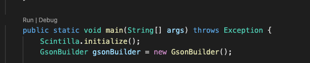
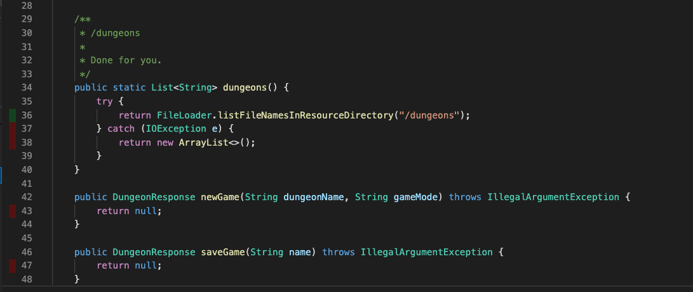
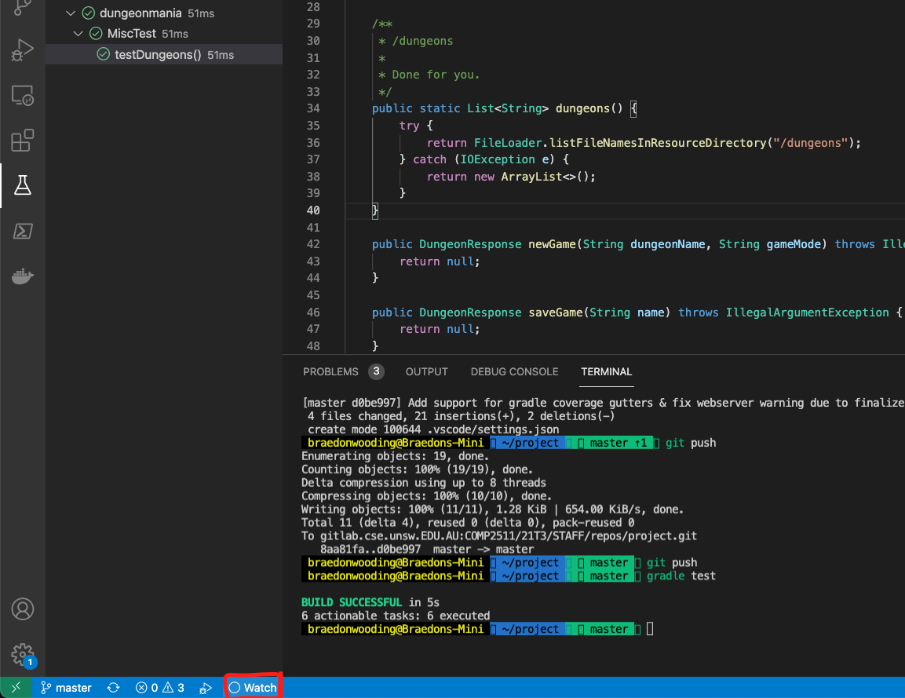
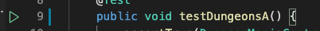
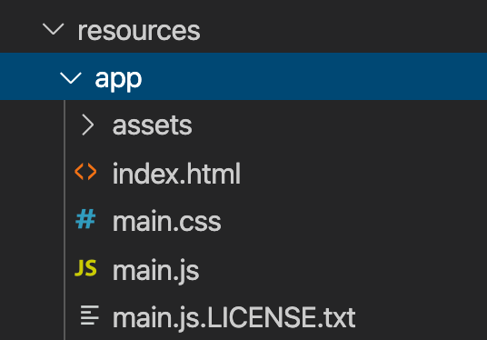
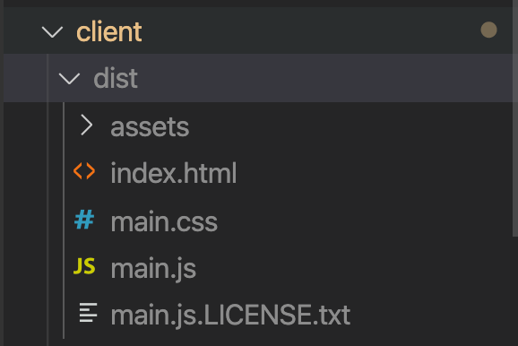

# 1. Setting Up Instructions

This page contains instructions for setting up and working locally.

[[_TOC_]]

## 1.1. Prerequisites

- Java JDK 17
- Gradle 8.5
- VSCode (Recommended) or IntelliJ
- Windows/MacOS/Linux
  - CSE is supported through VLAB
  - VSCode + SSH aren't supported
  - VSCode + WSL aren't explicitly supported, but the setup we use should work for it, however there is no xdg-open command in WSL (but it exists in linux) so you'll have to open the browser manually to the url localhost:4568/app/ the app/ part is important.
- Your assignment-ii repository (which we'll presume you'll be okay with cloning and managing)

## 1.2. How to open?

- You can open vscode and then go File -> Open (/Folder on MacOS) and select the folder assignment-ii that you've cloned locally.
  Make sure you have just the assignment-ii folder opened.
- To open in VSCode:
  - `code assignment-ii` (if working locally)
  - `2511 code assignment-ii` (if working on CSE machines)

## 1.3. How to run?

Firstly guarantee that the folder that you have opened is correct. Ensure that the name at the top of your explorer says <code>assignment-ii</code> - if it doesn't you don't have the right folder opened :)

Next, just locate the <code>App.java</code> file and click the run button on that file.


This will then synchronise your frontend with the current latest version and once that's done (should be very quick) it'll start the server.

## 1.4. How to generate coverage reports?

You can generate coverage reports through the use of <code>gradle test</code>. This will generate both human readable ones (html) as well as more computer readable ones (xml) which an extension can read and show you inline coverage.

You can see inline coverage reports via [Coverage Gutters](https://marketplace.visualstudio.com/items?itemName=ryanluker.vscode-coverage-gutters) which is a VSCode extension. An example of this is shown below.



If they aren't showing up for you make sure that the bottom left "Coverage" button is showing something like X% coverage (just informs about current opened file). If it isn't just click it!



## 1.5. How to test?

You can either run <code>gradle test</code> or go to the test file and click the run test button that'll appear to the left of the icon.



> How to debug tests? You just have to right click and then click debug test.

## 1.6. Resources

For running the frontend locally, you will need to place your dungeons and configurations inside <code>src/main/resources/</code>. If you want your resources to be accessible via Gradle and your JUnit tests then you will need to put them in <code>src/test/resources</code>.

The <code>FileLoader</code> class we have provided you with will load the resources from the correct directory automatically.

## 1.7. Recompiling the Frontend Locally

The frontend is simply some compiled JavaScript served as a static resource out of the <code>main/resources/app</code> folder.



You will need to install Node.js if you do not already have it installed on your machine.

To recompile the frontend:

```
cd client # Go into the client directory
npm install # Install required libraries
npm run build # Compile the frontend code
```

You will see a folder called <code>dist</code> (short for distribution, since this is what you’d use to deploy on a service like AWS) has now appeared inside <code>client</code> which has the exact same structure as <code>resources/app</code>:



Copy and paste the contents of dist into <code>resources/app</code>, overwriting everything that was there before.

When you next run the frontend locally it should include your changes.
